# INTER VISION

## Network Reconnaissance and Footprinting 


Network Reconnaissance and Footprinting is a cybersecurity minor project focused on ethical reconnaissance, footprinting, and network analysis using Kali Linux and open-source security tools. The project demonstrates how publicly accessible information about a target can be gathered and analyzed using standard reconnaissance methodologies.

---

# Project Overview

Reconnaissance and footprinting are the initial phases of cybersecurity assessment and ethical hacking. Attackers and security professionals use these techniques to gather information about domains, servers, services, DNS infrastructure, and exposed network resources.

This project demonstrates practical implementation of:

- WHOIS Enumeration
- DNS Enumeration
- MX and NS Record Analysis
- Subdomain Enumeration
- Google Dorking
- Ping Analysis
- Traceroute Analysis
- Web Server Fingerprinting
- Port Scanning using Nmap

The project was performed in a controlled and ethical environment using authorized public targets.

---

# Objectives

- Perform ethical reconnaissance on an authorized target
- Gather publicly available domain information
- Analyze DNS infrastructure
- Discover publicly accessible subdomains
- Perform network connectivity analysis
- Identify open ports and running services
- Understand the importance of footprinting in cybersecurity

---

# Tools and Technologies Used

| Tool       | Purpose                             |
| ---------- | ----------------------------------- |
| Kali Linux | Penetration Testing Environment     |
| Nmap       | Port Scanning and Service Detection |
| WHOIS      | Domain Information Gathering        |
| DIG        | DNS Enumeration                     |
| NSLOOKUP   | DNS Analysis                        |
| cURL       | HTTP Header Fingerprinting          |
| Sublist3r  | Subdomain Enumeration               |
| Ping       | Connectivity Analysis               |
| Traceroute | Network Path Analysis               |

---

# Project Structure

```text
INTER-VISION_Minor-Project/
│
├── README.md
├── .gitignore
│
├── docs/
│   ├── Minor_Project_Report.pdf
│
├── diagrams/
│   ├── system_architecture.png
│   ├── network_topology.png
│   └── workflow_diagram.png
│
├── screenshots/
│   ├── whois.png
│   ├── dns_enum.png
│   ├── mx_lookup.png
│   ├── ns_lookup.png
│   ├── subdomain_enum.png
│   ├── google_dorking_1.png
│   ├── google_dorking_2.png
│   ├── google_dorking_3.png
│   ├── ping.png
│   ├── traceroute.png
│   ├── web_fingerprint.png
│   └── nmap_scan.png
│
├── cmds/
│   └── commands_used.txt
│
└── results/
    └── findings_summary.txt
```

---

# Reconnaissance Workflow

Target Selection  
↓  
WHOIS Enumeration  
↓  
DNS Enumeration  
↓  
Subdomain Discovery  
↓  
Google Dorking  
↓  
Network Analysis  
↓  
Web Fingerprinting  
↓  
Port Scanning  
↓  
Report Generation

---

# Commands Used

## WHOIS Enumeration

```bash
whois nmap.org
```

## DNS Enumeration

```bash
nslookup scanme.nmap.org
dig scanme.nmap.org
```

## MX Record Lookup

```bash
nslookup -type=mx nmap.org
dig mx nmap.org
```

## NS Record Lookup

```bash
nslookup -type=ns nmap.org
dig ns nmap.org
```

## Subdomain Enumeration

```bash
sublist3r -d nmap.org
```

## Network Connectivity Analysis

```bash
ping -c 4 scanme.nmap.org
```

## Traceroute Analysis

```bash
traceroute scanme.nmap.org
```

## Web Server Fingerprinting

```bash
curl -I http://scanme.nmap.org
```

## Port Scanning

```bash
nmap -F scanme.nmap.org
```

---

# Key Findings

- **WHOIS Lookup:** `nmap.org` is registered via Dynadot Inc, created on 
  1999-01-18, expiring 2029-01-18. Domain uses `clientTransferProhibited` 
  status and DNSSEC is unsigned.

- **DNS Enumeration:** `scanme.nmap.org` resolves to `45.33.32.156` (IPv4) 
  and `2600:3c01::f03c:91ff:fe18:bb2f` (IPv6).

- **NS Records:** Nameservers are `ns1.linode.com` through `ns5.linode.com`, 
  indicating DNS is hosted on Linode infrastructure.

- **MX Records:** Mail for `nmap.org` is routed entirely through Google's 
  mail servers (`ASPMX.L.GOOGLE.COM` and `ASPMX2/3.GOOGLEMAIL.COM`), 
  confirming Google Workspace is used for email.

- **Subdomain Enumeration:** Sublist3r identified 5 unique subdomains: 
  `www.nmap.org`, `issues.nmap.org`, `scanme.nmap.org`, `svn.nmap.org`, 
  and `www.svn.nmap.org`.

- **Google Dorking:** `filetype:pdf` dork surfaced indexed Nmap 
  documentation PDFs (Table of Contents, Host Discovery Techniques paper). 
  An `intitle:"index of"` dork revealed an open directory listing at 
  `scanme.nmap.org/images`, exposing a browsable file index.

- **Ping Analysis:** 4/4 packets received (0% packet loss) against 
  `scanme.nmap.org`, with round-trip time averaging ~419ms 
  (min 237ms / max 855ms).

- **Traceroute Analysis:** Only the first hop (local gateway, ~12ms) 
  responded; all subsequent hops timed out, indicating ICMP is blocked 
  or filtered along the path to the target.

- **Web Server Fingerprinting:** HTTPS (port 443) refused connection. 
  HTTP (port 80) returned `200 OK` with header `Server: Apache/2.4.7 (Ubuntu)`, 
  revealing the web server software and OS.

- **Port Scanning (Nmap):** Fast scan (`-F`) found 2 open ports on 
  `scanme.nmap.org`: **22/tcp (SSH)** and **80/tcp (HTTP)**. 91 other 
  common ports were filtered (no response).

---

## Screenshots

### WHOIS Enumeration
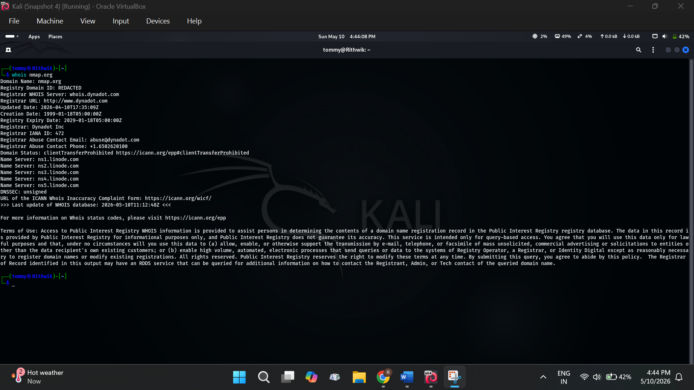

### DNS Enumeration
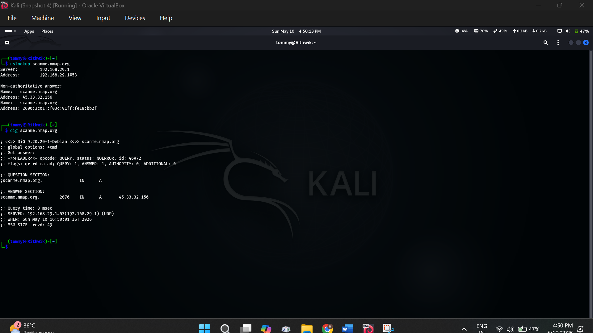

### MX Record Lookup
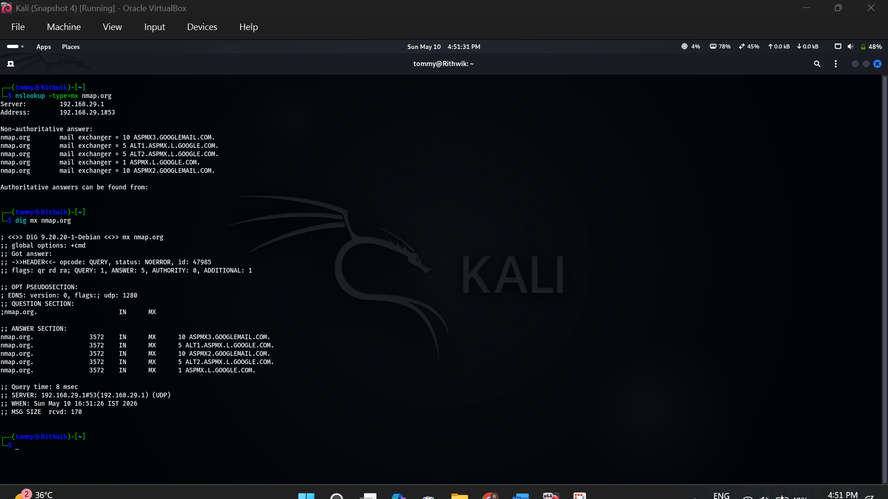

### NS Record Lookup
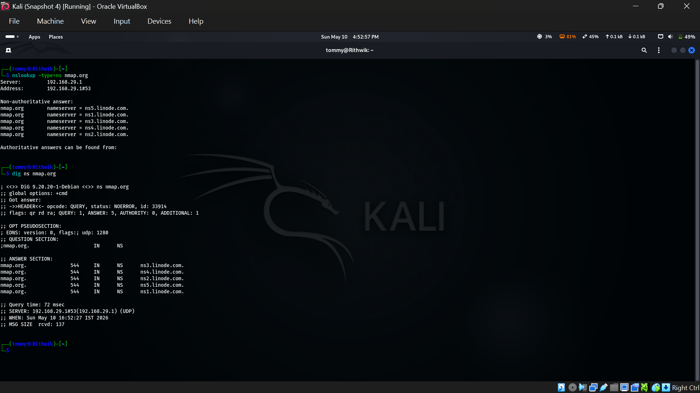

### Subdomain Enumeration
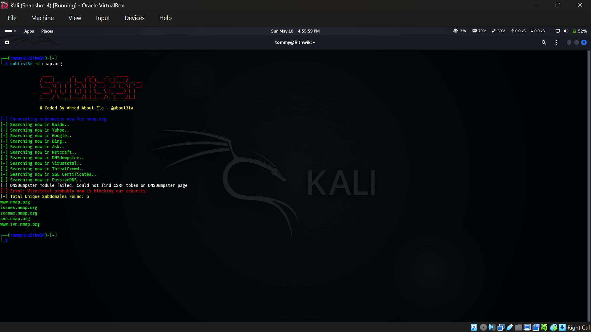

### Google Dorking
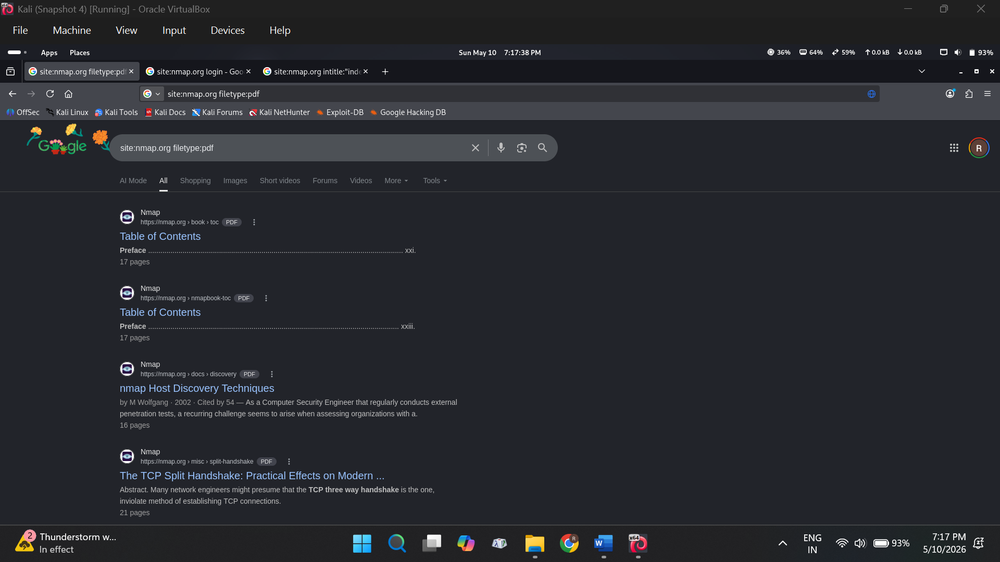
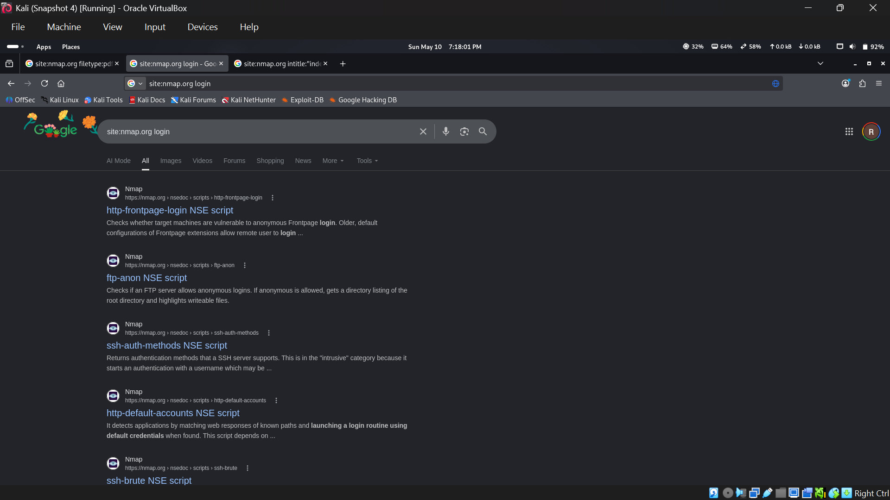
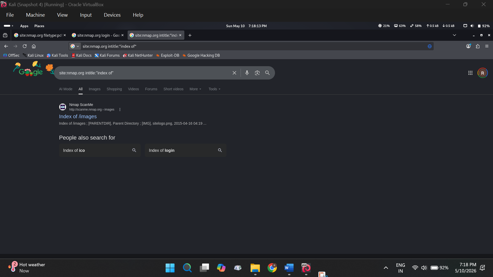

### Ping Analysis
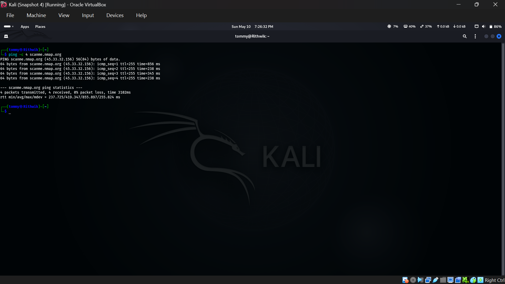

### Traceroute Analysis
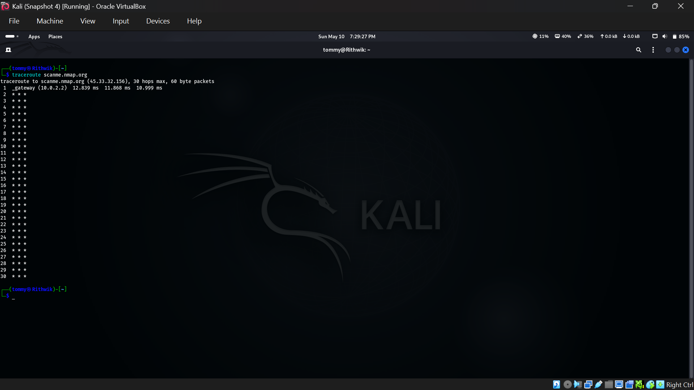

### Web Server Fingerprinting
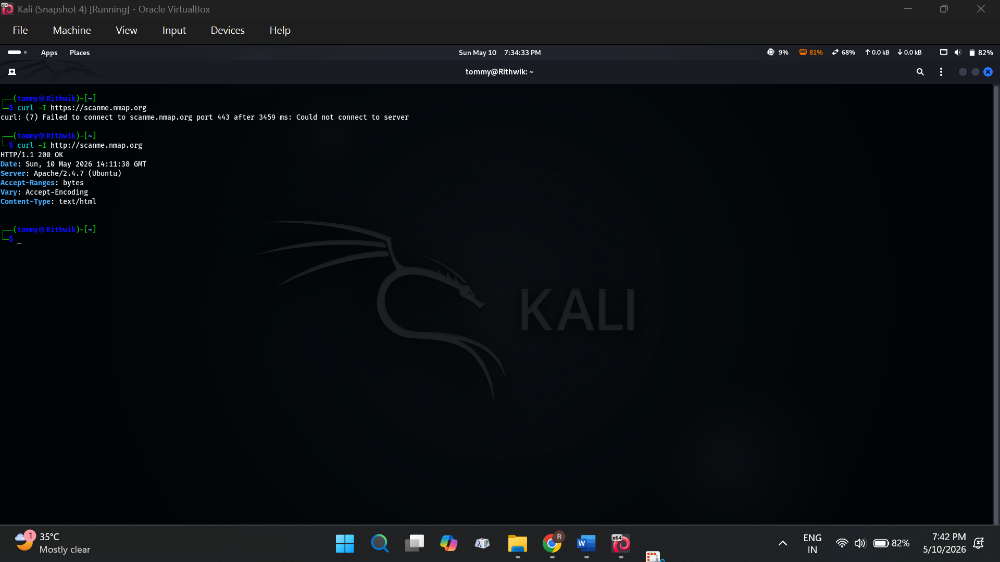

### Port Scanning (Nmap)
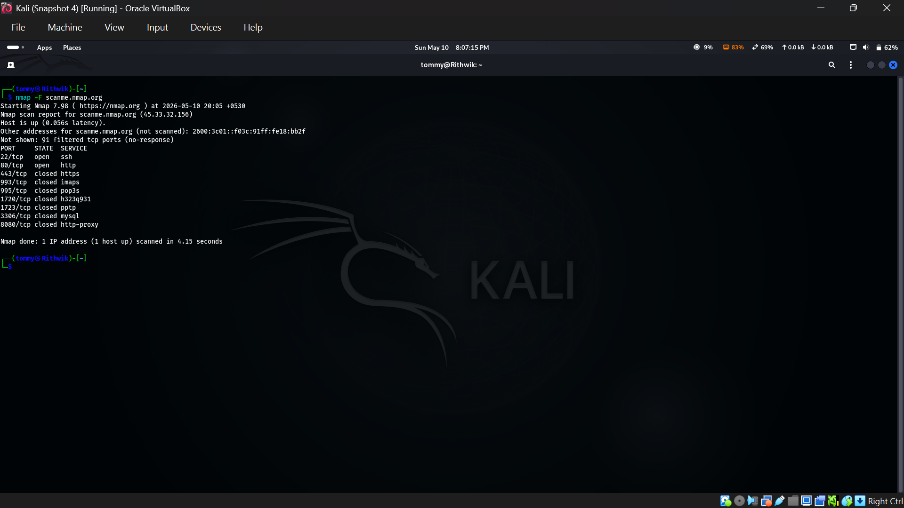

---

# Documentation

Complete project documentation is available in the `docs/` directory.

---

# Ethical Use Disclaimer

This project is developed strictly for educational and authorized cybersecurity assessment purposes only.

The techniques demonstrated in this repository must only be performed on systems and targets for which explicit permission has been obtained.

Unauthorized scanning, reconnaissance, or exploitation of systems is illegal and unethical.

---

# Future Enhancements

- Automated report generation
- Web-based dashboard integration
- Vulnerability assessment module
- AI-assisted reconnaissance analysis
- Scan history management

---

# Author

**M Rithwik Kumar**  
Cyber Security Engineering Student
